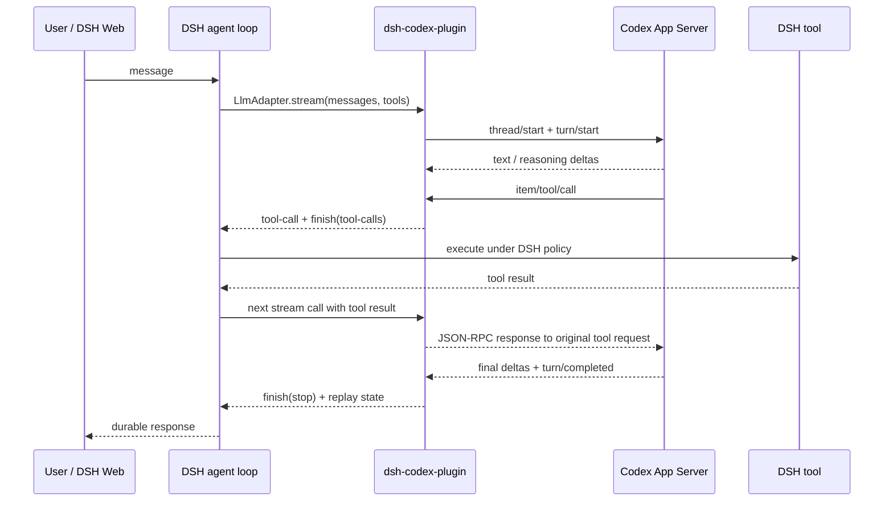

# dsh-codex-plugin

Use a ChatGPT-authenticated Codex CLI as the primary model inside
[DeepSeek Harness](https://github.com/deepseek-ai/deepseek-harness). DSH keeps
its agent loop, tools, sessions, UI, permissions, and telemetry; this adapter
replaces the model transport with `codex app-server --stdio`.

This repository is an independent implementation with fresh source, tests,
documentation, and Git history. It does not copy the implementation or history
of another DSH Codex plugin. See [Independent implementation](docs/INDEPENDENCE.md).

## What works

- ChatGPT login from `codex login`
- Live model discovery through `model/list`
- DSH text and reasoning-summary streaming
- DSH tools bridged through Codex dynamic tools
- Multi-step tool continuation on the same Codex turn
- DSH image attachments as inline Codex image inputs
- Token and cache-usage normalization
- Per-session Codex workspaces with a configured fallback
- DSH bundle install that switches new agents to `codex-cli`
- Managed subprocess cleanup, cancellation, and idle-session eviction

Validated with DSH `0.1.0-rc.6` and Codex CLI `0.147.0`. See the
[evaluation report](evals/REPORT-2026-08-17.md).

## How it works



One App Server process is retained per active DSH session. When Codex calls a
dynamic tool, the adapter pauses that App Server request, returns the tool call
to DSH, and answers the same request when DSH supplies the result. Codex then
continues the original turn.

## Requirements

- Node.js `^22.19.0` or `>=24.0.0` (the DSH runtime requirement)
- DeepSeek Harness `>=0.1.0-rc.5 <0.2.0`
- Codex CLI `0.147.0`
- A working ChatGPT login:

```sh
codex login status
```

## Install from a checkout

```sh
git clone https://github.com/snowan/dsh-codex-plugin.git
cd dsh-codex-plugin
npm install
npm run verify
npm run doctor
dsh plugin --profile web add .
```

Restart DSH after installing. The bundle:

1. mounts the adapter as provider `codex-cli`;
2. changes the default for newly created agents to
   `codex-cli / gpt-5.6-terra`.

Existing sessions keep the model they started with. DSH Web's model picker can
still select another registered provider.

To keep Codex installed but use another default, add a later override to the
profile's `cordis.patch.yml`:

```yaml
- id: agent-default-model
  config:
    provider: codex-cli
    model: gpt-5.6-sol
```

## Configuration

```yaml
- id: llm-codex-cli
  name: '@snowan/dsh-codex-plugin'
  config:
    codexCommand: codex
    allowCodexNativeTools: false
    cwd: /absolute/workspace/path
    contextWindow: 200000
    modelCacheMs: 300000
    sessionIdleMs: 900000
    disposeGraceMs: 3000
```

| Field | Default | Purpose |
| --- | ---: | --- |
| `codexCommand` | `codex` | Executable resolved by DSH's subprocess runtime |
| `cwd` | DSH process cwd | Fallback when a request has no session workspace |
| `env` | `{}` | Explicit additions to Codex's child environment |
| `allowCodexNativeTools` | `false` | Keep actions on DSH's dynamic-tool plane |
| `contextWindow` | `200000` | Conservative capacity advertised to DSH |
| `modelCacheMs` | `300000` | Codex model-list cache lifetime |
| `sessionIdleMs` | `900000` | Deadline before an inactive session process is terminated |
| `disposeGraceMs` | `3000` | Grace before subprocess termination escalates |

## Diagnose

```sh
npm run doctor
```

The doctor verifies the Codex version, ChatGPT login, App Server handshake, and
live model discovery. It never prints credential material.

If DSH shows a red `Read` card for a missing optional configuration file, that
is a real DSH filesystem error rather than a Codex connection failure. The
adapter tells Codex to check optional candidate paths with `glob` or a non-error
existence test first, and to call `read` only for confirmed files. Genuine read
failures remain visible instead of being silently converted to success.

## Develop and test

```sh
npm run typecheck
npm test
npm run verify
node evals/run-real.mjs
```

The deterministic suite uses a scripted JSON-RPC server. The real evaluation
requires the existing Codex login and makes live model requests.

## Current boundaries

- Dynamic tools are an experimental Codex App Server API, so a future Codex
  release can require protocol changes. The package pins `@openai/codex` and
  tests against CLI `0.147.0`.
- A pending DSH tool call is kept in process memory. If its App Server exits,
  the adapter returns `CODEX_SESSION_LOST` with the affected call ids instead
  of writing the result to a closed transport. The next clean user turn
  reconstructs a fresh thread from DSH history.
- The adapter serializes calls within one DSH session. Independent sessions use
  independent App Server processes.
- The adapter prefers a request's optional `GenerateOptions.cwd` when starting
  a Codex thread. DSH releases that do not forward a session workspace use the
  configured `cwd` fallback.
- Codex-native shell, apps, MCP, browser, and related feature surfaces are
  disabled by default so DSH owns the durable action policy and audit trail.
  Set `allowCodexNativeTools: true` only when that extra action plane is wanted.

## License

MIT. Built by snowan with Codex.
