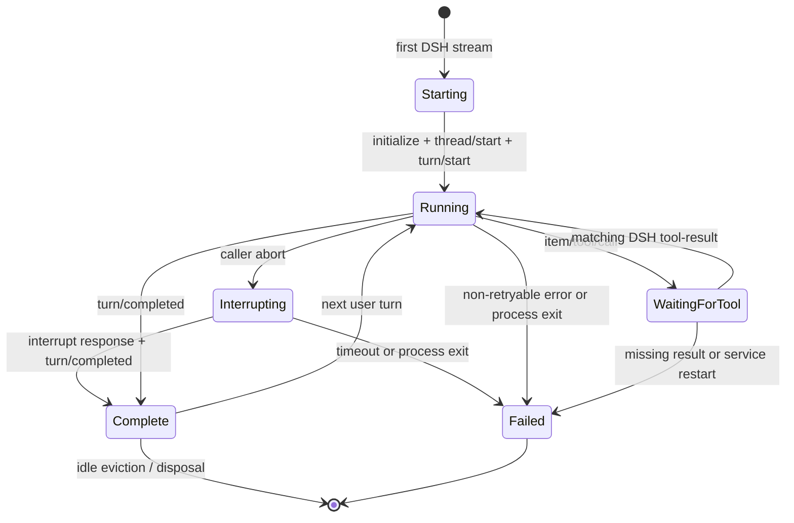

# Architecture

## Design goal

Make Codex the DSH primary model without replacing DSH's agent loop. The
adapter therefore implements DSH's provider-neutral `LlmAdapter` boundary and
translates it to Codex App Server v2.

## Components

| Module | Responsibility |
| --- | --- |
| `rpc-client.ts` | JSONL framing, bidirectional request routing, cancellation, process closure |
| `process.ts` | DSH-managed process spawn, initialize handshake, paginated model discovery |
| `translate.ts` | Messages, JSON Schemas, images, and tool results |
| `bridge.ts` | Per-session thread/turn state and tool-call continuation |
| `adapter.ts` | DSH `LlmAdapter` catalog, metadata, and streaming surface |
| `index.ts` | Cordis plugin configuration and provider registration |
| `doctor.ts` | Standalone login and protocol diagnostics |

## State machine

Every retained session receives an unref'd idle timer after a stream releases
it. Reuse cancels that timer before setting the session busy and arms a new
deadline after the stream finishes. Disposal clears the timer before stopping
the process. The request-time idle sweep remains as a defensive check, but
cleanup no longer depends on a future request reaching the bridge.

An aborted DSH stream does not make the session reusable immediately. The
bridge first waits for the `turn/interrupt` response and the matching terminal
`turn/completed` event. If either boundary misses the configured process grace
period, the bridge invalidates that App Server instead of risking a second
`turn/start` against a still-active turn.

## Tool identity

Codex's `callId` becomes the DSH `ToolCallBlock.id`. DSH returns the same value
as `ToolResultBlock.toolCallId`. The bridge uses that identity to respond to the
original server-to-client JSON-RPC request. No tool output is placed into a new
Codex user turn.

## History and replay

While the process is live, Codex owns its thread history and DSH owns the
durable session log. The adapter returns a small JSON replay marker containing
bridge, thread, turn, and pending-call identities. If the in-memory process is
gone, the next request seeds a new Codex thread with a canonical transcript
derived from the DSH message history. If the process exits while a dynamic-tool
request is pending, that bidirectional request cannot be recreated: the adapter
invalidates the closed session and returns `CODEX_SESSION_LOST` with the pending
call ids. A later clean request can then start a fresh thread without reusing
the closed transport.

## Safety boundary

The child process is started by `ctx.subprocess`, not raw `child_process`, so
DSH owns the process tree, explicit environment, bounded stderr, cancellation,
and termination grace. Codex threads use read-only sandboxing and `never`
approval. Thread config disables Codex-native shell, apps, MCP, browser, and
related action features by default, while model instructions direct actions
through DSH dynamic tools. DSH executes those tools under its own permission
and audit services.
