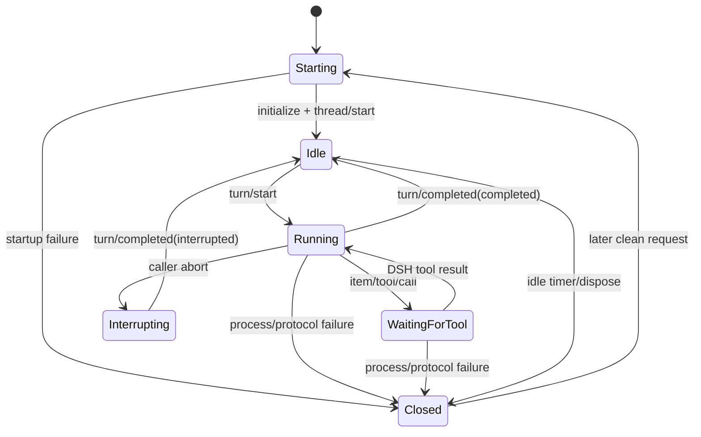
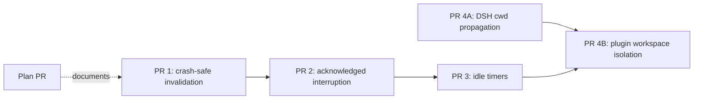

# P0 hardening implementation plan

## Status

- Scope: `dsh-codex-plugin` lifecycle correctness and workspace isolation
- Baseline: `fb6eea0` (`main`)
- DSH tested: `0.1.0-rc.6`
- Codex CLI tested: `0.147.0`
- Delivery: one reviewable pull request per improvement

## Why this work is required

The adapter's normal path is healthy: the deterministic suite passes, model
discovery works, a real Codex turn streams successfully, and a DSH dynamic tool
can pause and resume the same App Server turn. Targeted failure probes found
four lifecycle or isolation gaps that the happy-path suite does not cover:

1. a process exit while a DSH tool result is pending leaves the session bound
   to a closed App Server client;
2. cancellation reports completion before App Server has acknowledged the
   interrupt and emitted the terminal turn event;
3. idle App Server processes are collected only when some later call happens
   to enter the adapter;
4. DSH does not currently carry a session workspace through
   `GenerateOptions`, so every Codex thread uses the plugin-global `cwd`.

The official App Server lifecycle defines `turn/completed` as the terminal
event after either ordinary completion or `turn/interrupt`. It also supports
thread and turn working-directory configuration. The adapter should preserve
those lifecycle boundaries rather than treating transport writes as terminal
state.

## Design principles

- DSH remains the owner of tools, durable history, permission policy, and
  retries.
- App Server transport state must never outlive the child process that owns it.
- A session is reusable only after its previous turn reached a terminal event.
- In-flight dynamic-tool requests are not silently replayed after a crash.
- Cleanup must happen without requiring future user traffic.
- Workspace identity is explicit input, not inferred from prompt text.
- Every fix begins with a deterministic regression test and retains the real
  Codex smoke evaluation.

## Target lifecycle



`Closed` is never retained as a usable session. A process loss while no tool
request is outstanding can be followed by a new App Server and reconstructed
DSH history. A process loss while waiting for a tool result produces an
explicit session-loss failure because the original bidirectional JSON-RPC
request no longer exists.

## PR 1: crash-safe session invalidation

### Goal

Never route a new DSH call to a closed App Server client.

### Changes

- Expose read-only closed state from `AppServerClient`.
- Introduce a typed session-loss error carrying:
  - whether DSH tool requests were pending;
  - the affected call ids;
  - the App Server exit information when available.
- Before resuming an existing session, verify that its client remains open.
- Remove and dispose closed state before any replacement is started.
- If no tool call is pending, start a fresh ephemeral thread and reconstruct
  input from DSH's supplied messages.
- If tool calls are pending, fail explicitly instead of pretending their
  results were accepted or retrying against the closed transport.
- Mark a session unusable when `closed` or `protocol-error` arrives during a
  turn, and remove it in the stream cleanup path.

### Regression tests

- process exits while waiting for a dynamic-tool result;
- repeated retries do not remain bound to the closed client;
- process exits between completed turns and the next call starts a new client;
- process exits while streaming and the next clean call starts a new client;
- no duplicate tool-result response is written.

### Acceptance criteria

- zero writes to a closed client;
- pending-tool loss is visible through one stable error code;
- clean requests recover with exactly one replacement process;
- all existing deterministic tests and the real evaluator pass.

## PR 2: acknowledged interruption

### Goal

Do not make a session reusable until App Server has completed cancellation.

### Changes

- Add an `interrupting` lifecycle state for an active turn.
- On caller abort, send `turn/interrupt` without the already-aborted signal.
- Await the interrupt response, then drain events through the matching
  `turn/completed` event with status `interrupted`.
- Bound acknowledgement and terminal-event waiting by the existing process
  disposal grace period.
- If acknowledgement or terminal completion times out, terminate and
  invalidate the App Server instead of returning an apparently reusable
  session.
- Clear `turnId` only after a matching terminal event or forced invalidation.
- Preserve one DSH `finish(aborted)` result for the caller.

### Regression tests

- abort during streamed output;
- next call cannot send `turn/start` before interrupt acknowledgement;
- acknowledged interrupt followed by terminal event reuses the same client;
- missing acknowledgement invalidates the client after the bound;
- process exit during interruption follows the crash-safe path;
- duplicate or unrelated terminal events do not unlock the session.

### Acceptance criteria

- no `turn already active` race after an aborted DSH call;
- exactly one terminal DSH chunk;
- bounded completion even when App Server stops responding;
- no unhandled interrupt-request rejection.

## PR 3: timer-driven idle cleanup

### Goal

Terminate inactive session processes when their deadline expires, even when no
later adapter call occurs.

### Changes

- Store one idle timer per retained session.
- Cancel the timer before a session becomes active.
- Re-arm it after a stream reaches an idle terminal state.
- Use `unref()` so cleanup timers do not keep DSH alive.
- Have the callback verify map identity and lifecycle state before disposal so
  a stale timer cannot terminate a reused or replaced session.
- Clear timers in every explicit, crash, tool-catalog-change, and manager
  disposal path.
- Keep a cheap opportunistic sweep only as defensive redundancy, not as the
  primary cleanup mechanism.

### Regression tests

- an idle client exits after its deadline without another stream call;
- reuse cancels the previous deadline;
- a stale timer cannot terminate a replacement session;
- a busy or interrupting session is never reaped;
- manager disposal clears all timers and processes;
- 50 retained fixture sessions all exit by their deadlines.

### Acceptance criteria

- idle process exits by `sessionIdleMs + disposeGraceMs + 2s`;
- zero orphan processes after manager disposal;
- zero timer handles keep the Node.js process alive;
- all lifecycle tests remain deterministic under repeated runs.

## PR 4A: DSH workspace propagation

### Goal

Make the active DSH session workspace available to LLM adapters.

### Repository

`deepseek-ai/deepseek-harness` (submitted from a user-owned fork when upstream
write access is unavailable).

### Changes

- Add optional `cwd` to provider-neutral `GenerateOptions`.
- Populate it from the authoritative session header/workspace in the agent
  loop when assembling every model request.
- Preserve it across ordinary generation, tool continuation, compaction, and
  session-title auxiliary calls where a workspace exists.
- Document that adapters must treat it as execution context, not model-visible
  prompt content.

### Regression tests

- two sessions with different recorded workspaces produce different
  `GenerateOptions.cwd` values;
- tool continuation retains the same workspace;
- a session without a workspace leaves `cwd` undefined;
- auxiliary calls do not invent a workspace.

### Acceptance criteria

- no prompt parsing or process-global lookup is required;
- existing adapters remain source-compatible because the field is optional;
- DSH typecheck and targeted agent-loop tests pass.

## PR 4B: plugin workspace isolation

### Goal

Use DSH's per-request workspace when starting Codex threads while retaining the
configured `cwd` as a compatibility fallback.

### Dependency

PR 4A, or a DSH release containing the equivalent `GenerateOptions.cwd` field.

### Changes

- Resolve `effectiveCwd = options.cwd ?? config.cwd`.
- Record `effectiveCwd` in the retained session state.
- Pass it to `thread/start`.
- If an existing session changes workspace, dispose its old client and start a
  new thread reconstructed from DSH history.
- Validate that the workspace is absolute before spawning Codex.
- Keep the static configuration documented as the fallback for older DSH
  versions and one-workspace deployments.

### Regression tests

- two sessions start threads in two distinct repositories;
- one session changing workspace starts exactly one replacement process;
- missing request cwd uses the configured fallback;
- a relative or empty request cwd is rejected before process spawn;
- no session reads another session's fixture repository.

### Acceptance criteria

- thread cwd matches the owning DSH session;
- no cross-workspace reuse;
- current DSH remains supported through the fallback;
- the real evaluator and a two-workspace full-DSH scenario pass.

## Delivery and dependency graph



The lifecycle PRs are a stack because they touch the same session state
machine. Each PR is reviewed against the preceding branch, so its diff contains
one improvement. The DSH workspace PR is independent. The plugin workspace PR
depends on both the lifecycle stack and the DSH API.

## Validation matrix

Every plugin PR must run:

```sh
npm run verify
npm run audit:provenance
npm pack --dry-run
```

Every lifecycle PR must also run its regression probe at least 20 times without
a failure. The final stack runs:

```sh
npm run doctor
node evals/run-real.mjs
```

The DSH workspace PR runs targeted tests plus the repository's required
typecheck/gates for the changed packages. Full Web validation uses an isolated
`DSH_HOME` and must prove that no DeepSeek API key is required in Codex mode.

## Explicitly deferred work

These are valuable improvements, but they are not mixed into the P0 fixes:

- one App Server process multiplexing many DSH sessions;
- `turn/steer` for a second user message during an active turn;
- broader Codex-native tool parity;
- latency and task-quality benchmark expansion.

Process pooling changes the event-routing architecture and should follow the
idle-cleanup evidence. Active-turn steering requires a DSH product decision
about whether a second message steers, queues, or cancels. Keeping both out of
the P0 stack makes crash, cancellation, cleanup, and workspace guarantees
independently reviewable.

## Rollout and rollback

- Merge in dependency order.
- Re-run the real evaluator after every lifecycle merge.
- Release the plugin only after the DSH compatibility range is verified.
- Each PR is revertible without reverting later unrelated work.
- If the DSH workspace API is delayed, ship PRs 1-3 and retain the documented
  global `cwd` fallback; do not infer a path from prompt text.
